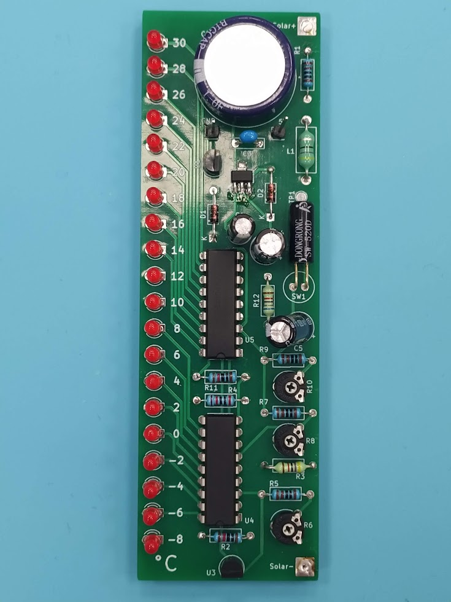
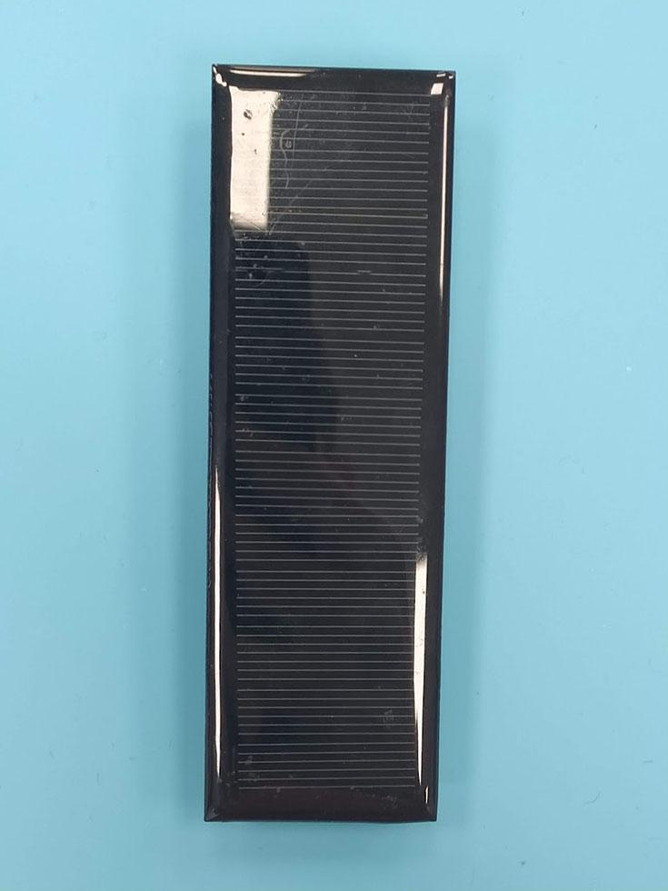
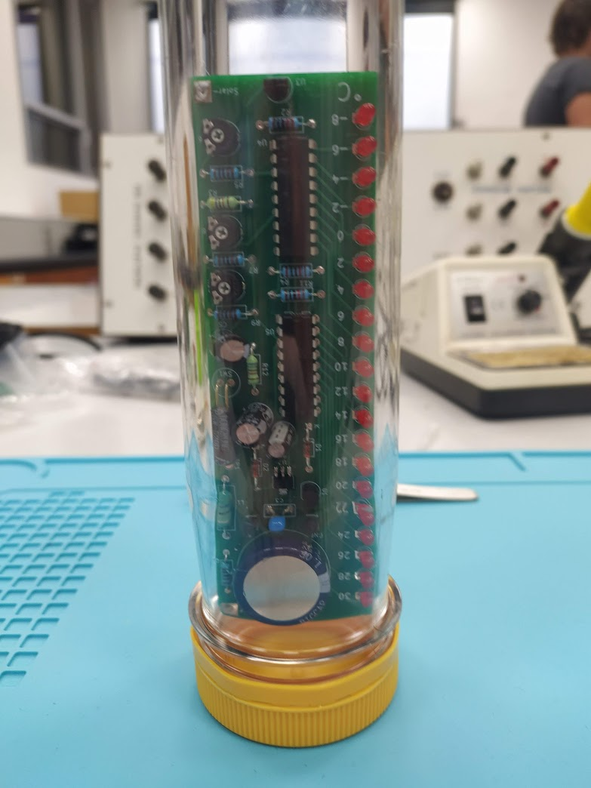

# Temperature Indicator

A 44 component rugged temperature-indicating PCB using solar power and a supercapacitor. Board is designed to
fit in a durable and cost efficent enclosure (PET bottle prefab) and sized exactly to the solar panel. Powered by
supercapacitor to retain charge during low temperatures.

Front             |  Back
:-------------------------:|:-------------------------:
 | 

